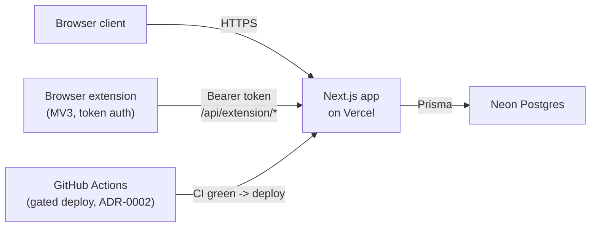
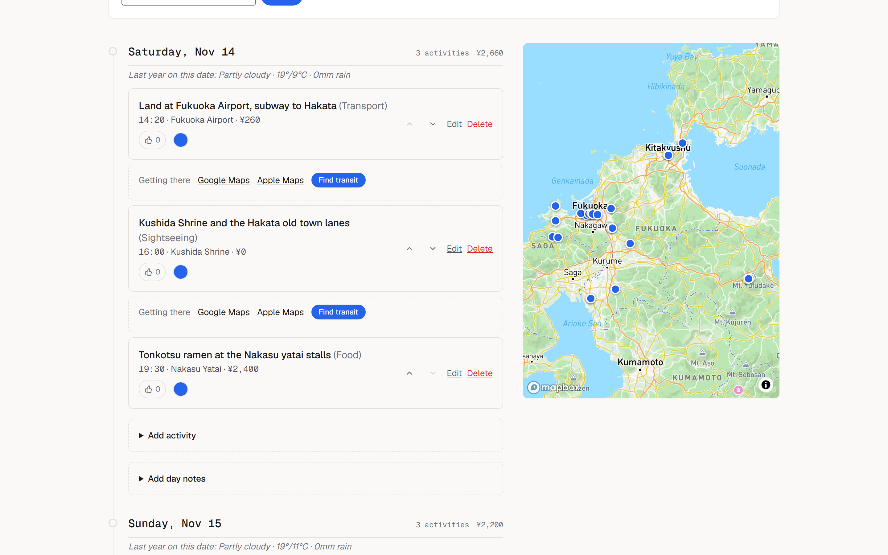
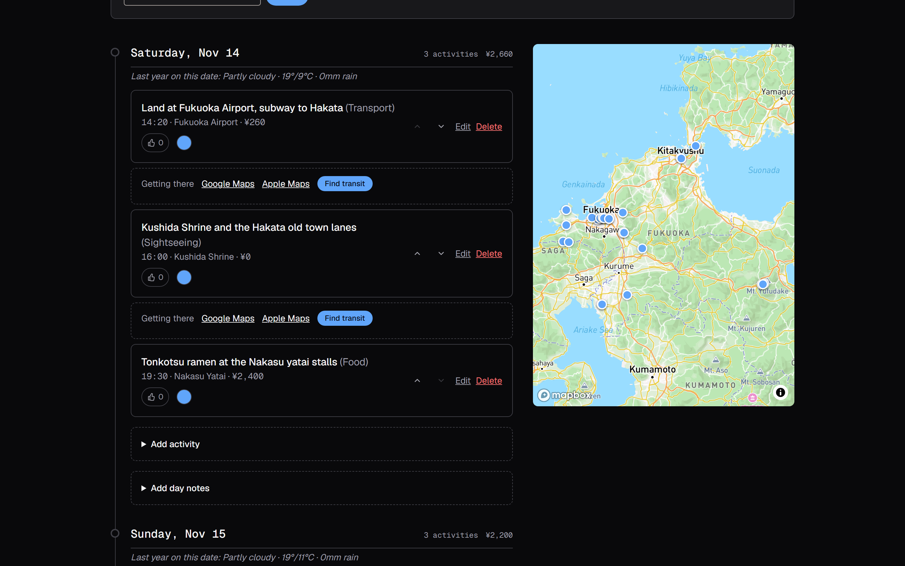
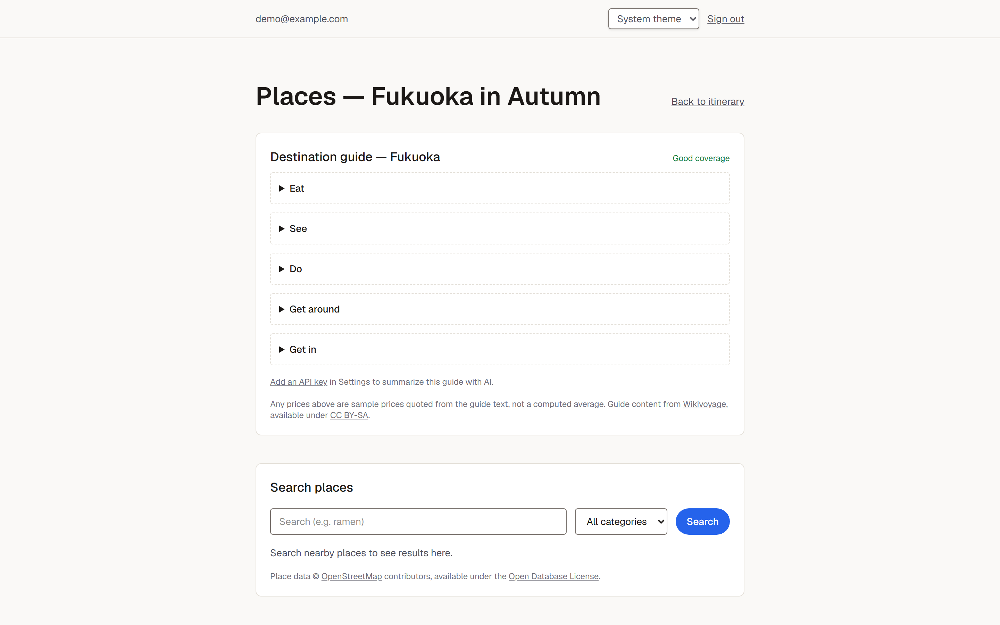
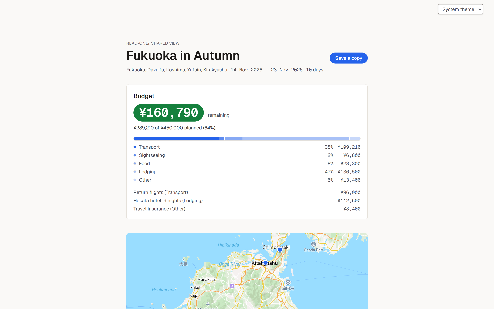

# Trip Planner

[](https://github.com/natcat38/trip-planner/actions/workflows/ci.yml)

A multi-user trip planner for longer, multi-city trips (Japan and Europe were the driving
use cases): a day-by-day itinerary, a budget that handles spending in several currencies at
once, a map that stays in sync with the plan, and a grounded research layer so planning a day
doesn't mean twenty browser tabs.

**Status: working app, actively in development.** Phases 1–3 are functional end-to-end —
trips, itinerary, multi-currency budget, maps, sharing, export, destination research, transit,
BYOK AI day planning, offline support, attachments, and a browser extension. Phase 4 has closed
several open items and given the app a real visual design (it is no longer the `create-next-app`
starter).

## Seeing it

**[Live demo — a shared trip, no sign-in needed](https://trip-planner-cyan-five.vercel.app/shared/YzdiQTCwe_2LuWzMswg4YWTNDGEOwcMQ)**
— a real trip on the production deployment, rendered through the public share route: the
day-by-day itinerary, the synced map, and a budget mixing GBP and JPY rolled up into the trip's
base currency. It is genuinely read-only — no edit or delete controls exist on that page, and
the payload never carries the owner or the token (see the sharing rule below).

The app itself sits behind Google/GitHub sign-in, but [`/`](https://trip-planner-cyan-five.vercel.app)
is a real (auth-free) landing page rather than the framework starter, so it's worth a look even
signed out.

To see the rest, run it locally — see [Running it](#running-it) below.

(The same trip URL and share token are hardcoded in `package.json`'s `test:e2e:prod` script —
update both together if the demo trip is ever reseeded or the token rotated.)

## Architecture



## What works today

- **Trips** — create, edit, and delete a trip with destinations, date range, a base currency,
  and a total budget. A trip's dashboard listing includes trips you own and trips you've
  accepted a collaborator invite on, through one shared access predicate.
- **Itinerary** — every date in the range gets a day; activities carry a title, place,
  category, start/end time, notes, cost, pin colour, votes, and explicit ordering within the
  day (move up/down controls — no drag-and-drop reordering).
- **Multi-currency budget** — log an activity cost or a standalone expense (flights, hotels)
  in whatever currency you actually paid in. The budget panel converts everything into the
  trip's base currency and rolls it up against the budget.
- **Maps** — activity place names are geocoded server-side on create and update, and the
  Mapbox map view stays in sync in both directions: click an activity in the itinerary and
  the map flies to its pin, click a pin and the activity highlights in the list.
- **Destination research** — a saved-places tray backed by keyless, grounded sources: OSM/
  Overpass for places, Wikivoyage guide prose for what things cost and how to get around, and
  Transitous/MOTIS for real transit itineraries (with map deep-links as a permanent fallback
  where no route exists). No fact reaches the UI unless it traces to one of these sources —
  see ADR-0008.
- **AI day planning (BYOK)** — a short questionnaire turns the saved-places tray into 2–3
  candidate day plans. Bring your own Groq or OpenRouter key (Groq is the documented default
  on privacy grounds, but its sign-up page was broken when tested — Aug 2026 — so OpenRouter is
  the provider actually exercised in production); every place the model
  returns is validated server-side against the real candidate pool, so a hallucinated place
  can never render. No key, or any AI failure, falls back to a deterministic algorithmic path —
  nobody is locked out. See ADR-0011, ADR-0012.
- **Weather** — a real forecast inside Open-Meteo's 16-day window; beyond that, last year's
  actuals for the same calendar date, clearly labelled as historical, never presented as a
  forecast.
- **ICS export & trip duplication** — download a trip's itinerary as a calendar file
  (floating local time — see ADR-0013), or duplicate a trip (your own or someone else's shared
  one) into a fresh copy that never carries over the share token, collaborators, or votes.
- **Quality-of-life pack** — packing-list checklists, day notes, per-activity votes, pin
  colours, and a light/dark theme toggle (system by default, no flash on load).
- **Offline** — a service worker caches visited itinerary/budget/notes pages for read-only
  offline access. The map is not cached (Mapbox's own tile-caching terms don't allow it — see
  ADR-0015), so the offline map area asks for a connection instead.
- **Attachments** — upload booking confirmations, tickets, and screenshots to a trip (stored
  as Postgres `bytea`, capped per-file and per-trip by Neon's free-tier size). Never included
  on `/shared/<token>` or in trip duplication.
- **Browser extension** — an MV3 extension that saves a place to a trip from any webpage,
  authenticated with a per-user bearer token (not the session cookie) and geocoded server-side
  through the app's existing Mapbox pipeline.
- **Auth** — Auth.js v5 with Google and GitHub, database-backed sessions, and a sign-out
  control that also clears the offline worker's caches.
- **Sharing** — a trip can be published to a read-only public link, and named Collaborators
  can be invited by email (accept/decline, full edit rights once accepted). Every access
  check runs through the same ownership scope, so a collaborator's reach is enforced in one
  place rather than per-route.
- **Export** — a print-styled itinerary page rendered for the browser's native print-to-PDF,
  no server-side PDF generation (ADR-0007).

## Decisions worth reading

The reasoning lives in [`docs/adr/`](docs/adr/) — see [`docs/adr/README.md`](docs/adr/README.md)
for the full index of all 19. The ones that shaped the code most:

- **[ADR-0001](docs/adr/0001-deploy-vercel-neon-defer-aws.md) — Vercel + Neon, AWS deferred.**
  The original scope assumed ECS Fargate + RDS at ~$40–70/month. Against a $0/month
  constraint, that infra buys almost nothing a live URL and green CI don't already
  demonstrate, so Terraform/ECS/RDS became an optional post-ship milestone.
- **[ADR-0003](docs/adr/0003-optimistic-locking.md) — optimistic locking from day one.**
  Every mutable model carries `updatedAt`; mutations send the client's last-seen value and
  the write is rejected if it's stale. Built in Phase 1, before conflicts were even possible,
  precisely because it's cheap up front and error-prone to retrofit once collaborators (Phase 2) make concurrent edits real.
- **[ADR-0008](docs/adr/0008-grounded-research-no-generative-layer.md) — research is grounded
  in OSM + Wikivoyage, no generative layer.** Live verification found OSM carries essentially
  no price data and "average meal cost" isn't obtainable from anything free, so v1 ships with
  no LLM at all: two keyless sources, an honest `good`/`thin`/`none` coverage indicator, and a
  standing rule that no user-visible fact may ever be model-generated.
- **[ADR-0011](docs/adr/0011-byok-ai-groq-default.md) — Groq is the default BYOK provider, on
  privacy grounds.** Re-verifying live terms reversed the original plan: OpenRouter's free
  endpoints require permission to train on and publish prompts, while Groq's default is
  no-training. Groq's own Services Agreement opens with "not for consumer use," an ambiguity
  this app carries knowingly rather than treats as resolved.
- **[ADR-0012](docs/adr/0012-day-generation-grounded-by-id-validation.md) — day-plan grounding
  is enforced by server-side id validation, not a prompt.** The model returns place ids only;
  every id is checked against the real candidate pool before anything reaches the user. This
  makes ADR-0008's rule structurally true instead of merely requested.
- **[ADR-0016](docs/adr/0016-attachments-in-postgres-bytea.md) — attachments as Postgres
  `bytea`, capped by two external ceilings.** 4 MB/file (Vercel's function body limit) and
  20 MB/trip (so a handful of trips can't exhaust Neon's 0.5 GB free-tier database). Content
  type is sniffed from the file's bytes on upload and re-checked on download — the declared
  type is never trusted — because these bytes are later served from the app's own origin.
- **[ADR-0019](docs/adr/0019-visual-design-direction.md) — a "departure board" visual
  direction.** Moves off the unmodified `create-next-app` starter look: a warm-neutral
  ink/paper palette, one reconciled accent colour used consistently instead of declared five
  separate times, and tabular numerals for every time/date/money value so an itinerary reads
  like a timetable.

Two rules the code holds to throughout:

- **Money is never a float.** Integer minor units plus an ISO 4217 currency code, converted
  only on read (`src/lib/money.ts`, `src/lib/fx.ts`).
- **Nested resources are never addressed by their own id alone.** Days, activities, and
  expenses are always reached through an access check on their trip
  (`src/server/auth-scope.ts`). There are exactly three gates: `requireTripAccess` (owner or
  accepted collaborator) for reads and edits and `requireTripOwner` (owner only) for deleting
  a trip and managing its sharing, both in `auth-scope.ts`, plus `requireShareToken` for the
  public link, kept private to `src/server/sharing.ts` so nothing else can reach a trip by
  token. The share route is the only one with no session at all, so it strips `userId` and
  `shareToken` from its payload rather than trusting callers not to leak them. The browser
  extension's API routes (`/api/extension/*`) are a second no-session surface, authenticated
  instead by a per-user bearer token (ADR-0017).

## Stack

Next.js 16 (App Router) · React 19 · TypeScript · Tailwind 4 · Prisma 7 · PostgreSQL ·
Auth.js v5 · Mapbox GL · Vitest · Playwright.

Postgres runs in Docker locally and on Neon in production. FX rates come from
exchangerate-api.com, refreshed server-side once a day so the key never reaches the browser.
The research layer adds three more keyless third-party sources — OSM/Overpass, Wikivoyage, and
Transitous — plus a user-supplied Groq or OpenRouter key for AI day planning (BYOK, encrypted
at rest, never an app-held key) and Open-Meteo for weather. No new npm dependency was added for
crypto, ICS generation, or MIME sniffing — all hand-rolled against Node's `crypto` and the
relevant RFC/format spec.

## Tests and CI

The quality gate in [`.github/workflows/ci.yml`](.github/workflows/ci.yml) runs `tsc --noEmit`,
ESLint, a Prettier check, a generated-file-map check (`FILE-MAP.md`, regenerated from each
directory's TSDoc `@packageDocumentation` block), `prisma migrate deploy`, the Vitest suite,
and Playwright end-to-end tests. Deployment is a separate job gated behind it.
[`.github/workflows/okf.yml`](.github/workflows/okf.yml) separately validates the
`knowledge/` bundle against the house documentation standard.

The `*.db.test.ts` suites run against a real Postgres instance rather than a mocked Prisma
client — budget roll-up across currencies and activity geocoding are the kind of thing where
a mock would happily agree with a bug. `src/lib/offline.test.ts` evaluates the actual shipped
`public/sw.js` in a `node:vm` sandbox rather than re-implementing its logic in a test, so the
two can't drift apart.

## Running it

```bash
cp .env.example .env    # fill in AUTH_*, MAPBOX_TOKEN, EXCHANGE_RATE_API_KEY, ENCRYPTION_KEY
docker compose up       # app on :3000, Postgres on :5432
```

Then apply migrations and, optionally, seed:

```bash
npx prisma migrate dev
npm run db:seed
```

To run the app natively against the same database, use `npm run dev` instead of the `app`
service. Other scripts: `npm run test`, `npm run test:e2e`, `npm run lint`, `npm run format`,
`npm run db:size` (a manual Postgres-size trend check against Neon's free-tier cap).

Auth needs real OAuth credentials — sign-in will not work with an empty `.env`. `.env.example`
lists every required variable and which ones are safe to expose to the browser. The AI layer
and the browser extension are opt-in per user (bring your own key / generate your own token in
Settings) and need no extra server-side secret beyond `ENCRYPTION_KEY`.

## What's not done

- **Collaborator invites aren't delivered.** Inviting writes the row; the invitee finds out
  by signing in and seeing the pending-invites banner. No email is sent.
- **Collaborators are only an email string.** ADR-0006 trades away the `User` foreign key,
  so there's no name or avatar to show without a separate lookup.
- **AWS/Terraform infrastructure** — deferred, not abandoned; see ADR-0001.
- **FX rates are daily, not historical.** An expense is converted at the current day's rate,
  not the rate on the date it was incurred.
- **ICS export is floating local time, not zoned.** `Day.date`/`Activity.startTime` carry no
  destination timezone today, so calendar exports aren't a reliable source of truth across a
  timezone-crossing trip (e.g. an overnight flight). See ADR-0013, ADR-0018 §2.
- **Attachments aren't encrypted at rest.** They're stored as plain `bytea`; the panel says
  outright that passports and ID don't belong there. Encrypting the column is deferred to its
  own milestone (a key-rotation story is real work), not silently skipped. See ADR-0016 §4.
- **Groq, the documented default AI provider, is unverified in practice.** Its sign-up page
  would not complete when tested (Aug 2026), so no Groq account exists to test with —
  OpenRouter is the provider actually used. Groq's "not for consumer use" clause also remains
  an open, unresolved risk, carried knowingly rather than cleared — see ADR-0011.
- **No drag-and-drop activity reordering** — explicit move-up/move-down controls only.
- **The browser extension's popup has no automated test.** The server surface it calls is
  fully covered by `e2e/extension-api.spec.ts`; the popup itself (`extension/popup.js`) could
  not be driven by Playwright in this environment — see ADR-0017 for the specific failure and
  the 30-second manual verification path.

## Screenshots

Captured from the seeded demo trip (`npm run db:seed`), light theme.

**Itinerary with the synced map** — day-by-day activities with costs, last-year weather,
per-leg transit links, and the Mapbox view that follows the plan:



The same view in dark mode (system-default theme toggle, no flash on load):



**Destination research** — Wikivoyage guide sections with a coverage indicator, and
OSM/Overpass place search:



**Public shared view** — the read-only `/shared/<token>` page a stranger can see, with the
multi-currency budget roll-up:


